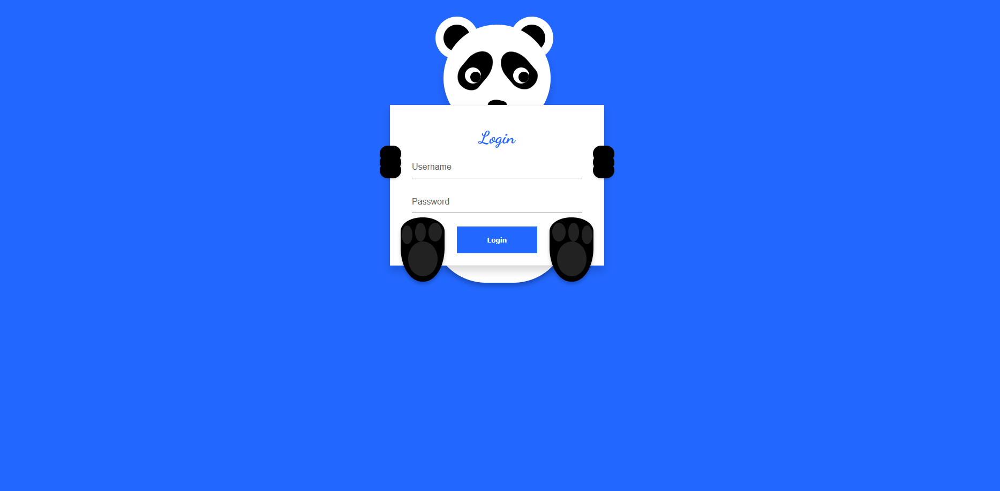

# 🐼 Panda Login Page

An **Animated Login Page** with a cute panda design built using **HTML, CSS, and jQuery**.
The panda reacts to user actions like typing a password or moving the mouse.

---

##  Project Structure

```
panda-login/
│── index.html       # Main HTML file
│── login.css        # Styles for panda and login form
│── preview.png      # Screenshot of the design
│── README.md        # Documentation
```

---

##  How to Run

1. Clone or download this repository.
2. Open `index.html` in a browser.
3. Enjoy the interactive panda login page! 

---

##  Technologies Used

* **HTML5** – structure
* **CSS3** – styling, panda graphics, and animations
* **jQuery** – interactive effects (eye movement, hands, form validation)
* **Google Fonts** – typography

---

##  Features

* Panda face & body created with pure CSS
* Eyes follow mouse pointer 
* Hands cover eyes while entering password 
* Smooth animations & hover effects
* Form error animation on invalid login

---

## 👨‍💻 Author

**MD MONTASIR RAHMAN ABHI**

* Web Designer | Web Developer | Digital Marketer
* 📧 Email: [montasirrahmanabhi01@gmail.com](mailto:montasirrahmanabhi01@gmail.com)
* 📞 Phone: +8801709105255
* Portfolio : <a href="https://www.montasirabhi.com/">

---

## 🌐 Live Preview

[🔗 Click here to view live demo](https://montasirabhi.github.io/Login-Templates/Panda_Login_Template/index.html)


---

## 📸 Preview Image



---

## 📜 License

This project is open-source and free to use for learning, practice, and personal projects.
