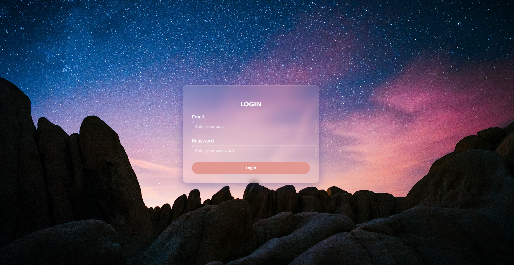

#  Transparent Login Page

A **modern glassmorphism-style login page** built using **HTML and CSS**.
The design features a blurred transparent background with smooth hover effects, perfect for any web project.

---

##  Project Structure

```
transparent-login/
│── index.html       # Main HTML file
│── style.css        # Styles for login form
│── Background.png   # Background image
│── Preview.png      # Screenshot of the design
│── README.md        # Documentation
```

---

## How to Run

1. Clone or download this repository.
2. Open `index.html` in your browser.
3. Customize `Background.png` with your own background if desired.

---

##  Technologies Used

* **HTML5** – structure
* **CSS3** – styling, glassmorphism effect, responsive layout
* **Google Fonts** – modern typography

---

##  Features

* Glassmorphism transparent login form
* Responsive design for desktop & mobile
* Smooth hover effects on login button
* Placeholder styling with custom fonts
* Easy to integrate into any project

---

##  Author

**MD MONTASIR RAHMAN ABHI**

* Web Designer | Web Developer | Digital Marketer
*  Email: [montasirrahmanabhi01@gmail.com](mailto:montasirrahmanabhi01@gmail.com)
*  Phone: +8801709105255
*  Portfolio: <a href="https://www.montasirabhi.com/">montasirabhi.com</a>

---

##  Live Preview

[🔗 Click here to view live demo](#)

---

##  Preview Image

  

---

##  License

This project is **open-source** and free to use for learning, practice, and personal projects.
